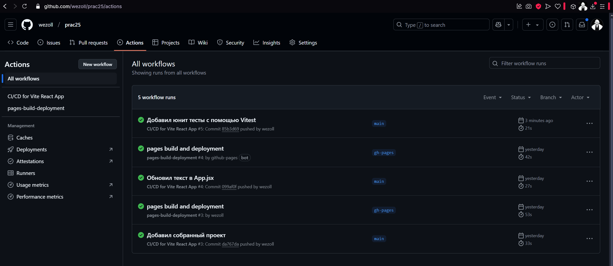

# Отчет по Практической работе №25: Применение CI/CD в проекте

## 1. Описание проекта
Проект представляет собой React-приложение, созданное с использованием Vite. В нем реализован простой интерфейс с заголовком, счетчиком и ссылками на документацию по Vite и React.

## 2. Цель CI/CD
Внедрение CI/CD направлено на автоматизацию процессов сборки, тестирования и развертывания проекта. Это позволяет:
- Обеспечить стабильность кода за счет автоматических проверок.
- Сократить время на ручное тестирование и интеграцию изменений.
- Автоматизировать процесс развертывания приложения (опционально).

## 3. Настройка CI/CD пайплайна
Для автоматизации процесса используется **GitHub Actions**. Настроены следующие этапы:
1. **Сборка проекта** – установка зависимостей и проверка компиляции.
2. **Тестирование** – запуск юнит-тестов с использованием Vitest.
3. **Развертывание** – развертывание приложения при пуше в `main`.

### Файл конфигурации `.github/workflows/ci.yml`
```yaml
name: CI/CD for Vite React App

on:
  push:
    branches:
      - main
  pull_request:
    branches:
      - main

jobs:
  build:
    runs-on: ubuntu-latest
    steps:
      - name: Checkout Repository
        uses: actions/checkout@v3

      - name: Setup Node.js
        uses: actions/setup-node@v3
        with:
          node-version: 18

      - name: Install Dependencies
        run: npm install

      - name: Build Project
        run: npm run build

      - name: Deploy to GitHub Pages
        if: github.ref == 'refs/heads/main'
        uses: JamesIves/github-pages-deploy-action@v4
        with:
          branch: gh-pages
          folder: dist
```

## 4. Тестирование
В проекте реализованы юнит-тесты с помощью **Vitest**. Проверяется:
- Отображение заголовка.
- Корректная работа счетчика.
- Наличие ссылок на документацию.

Пример тестов `src/App.test.jsx`:
```jsx
import { render, screen, fireEvent } from "@testing-library/react";
import "@testing-library/jest-dom";
import App from "./App";

test("отображает заголовок", () => {
  render(<App />);
  expect(screen.getByText("wezoll + React")).toBeInTheDocument();
});

test("увеличивает счетчик при клике", () => {
  render(<App />);
  const button = screen.getByText("count is 0");
  fireEvent.click(button);
  expect(screen.getByText("count is 1")).toBeInTheDocument();
});

test("ссылки на Vite и React присутствуют", () => {
  render(<App />);
  expect(screen.getByRole("link", { name: /Vite logo/i })).toHaveAttribute(
    "href",
    "https://vite.dev"
  );
  expect(screen.getByRole("link", { name: /React logo/i })).toHaveAttribute(
    "href",
    "https://react.dev"
  );
});
```

## 5. Результаты выполнения пайплайна
При каждом коммите в `main` запускаются этапы сборки и тестирования. В случае успешного выполнения тестов код считается готовым для развертывания.

**Пример успешного выполнения CI/CD пайплайна:**


## 6. Используемые технологии
- **React** + **Vite** – фронтенд-приложение.
- **GitHub Actions** – CI/CD пайплайн.
- **Vitest** + **@testing-library/react** – тестирование.
- **Node.js** – среда выполнения JavaScript.

## 7. Выводы
В ходе работы была настроена автоматизация CI/CD для React-проекта. Успешно реализованы этапы сборки и тестирования, обеспечивающие надежность кода. Настроенный процесс помогает оперативно находить ошибки и упрощает развертывание приложения.

